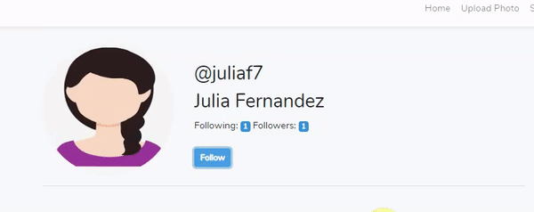

# Social media app Laravel
Social Media App Laravel

# How it works
* The system is built 100% in Laravel(some HTML, Javascript, JQuery and Ajax knowledge is required).

# Description
This social media app contains 7 different pages:

**Home Page**  
This page has all the photos uploaded by users. Here you will be able to see photos from those who have public accounts, the users you follow and follow you back, as well as your own photos.  
**Upload Photo**  
Here you can upload your photo with whatever description you want include.  
**Search**  
This section contains a submenu: 
-	Profile: As the name indicates here you can check and edit your profile.
-	My Photos: In this page you will find all the photos you have uploaded. Here you can edit and delete any photo.
-	Notifications: here you can check all the notifications created by users who have requested to follow you.
-	Logout

You can access to any user’s profile either using the search option mentioned before, or by clicking on the user’s nickname located at the top of the Photo.  
For this Social Media App I also have created my own Like and Follow-Unfollow functionalities. These functionalities change dynamically using Ajax and JQuery.  
  
  
For the Follow-Unfollow functionality you are able to follow any user with public account. For those users who have private account you need to request to follow them first. This will create a notification for that specific user located under the notification area mentioned before. There you can either accept or reject it.  
  

# Requirements
* Laravel.
* Web Server (I personally use XAMPP).
* MySQL.
* HTML
* CSS.
* Javascript/JQuery.
* Ajax

# How to use it
* Simply download the source file to your computer.
* Change database password and username if nedeed in the .env file.
* Save the files, upload them to your webserver and give it try.

# Author
Salvador Rodriguez (whole project).
